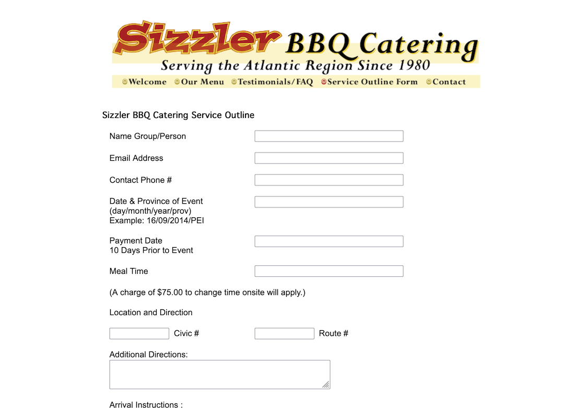
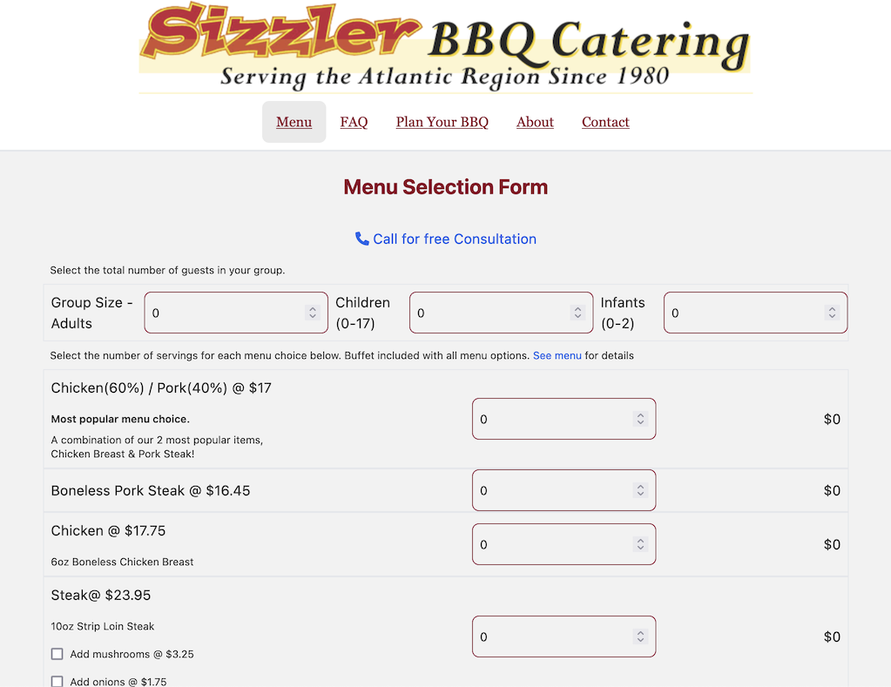

The famous [Sizzler BBQ](http://sizzlerbbq.com) was in need of a little website update. The existing site had been around for quite a while. We stuck with the basic design and content, but used my favourite Gatsby/Tailwinds stack to modernize the look and feel, and make it more mobile responsive. 

In addition to the look and feel, the big improvement here was the form. The old site used a static HTML form to get details on event booking (menu choices, location, etc)
I was able to use the React/Gatsby site tooling to build a custom form that dynamically generates a prices estimate, including a travel time charge that is based on the location and travel time (from the MapBox API)
The custom form passes information to a google form that handles the submission of the form. 

before:

after: 

Thanks @sizzlerbbq!